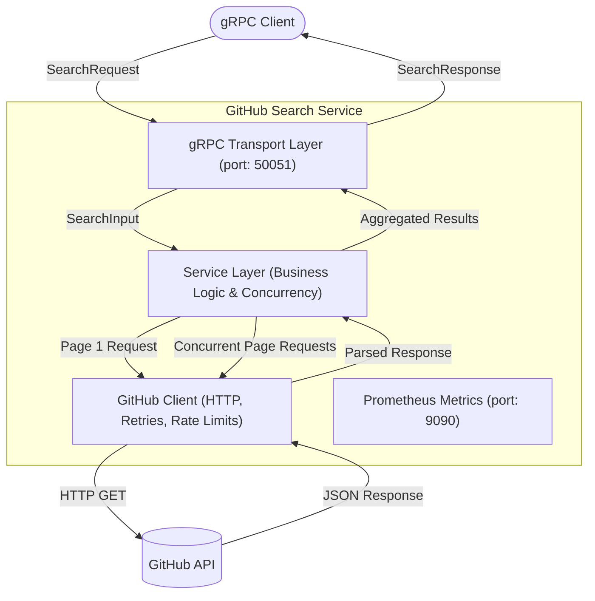
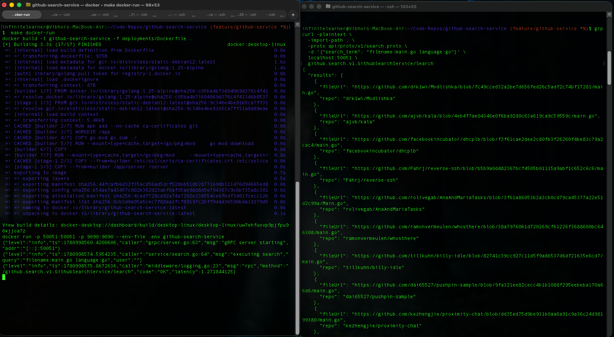

# GitHub Search Service

A gRPC service to search through GitHub repositories.

## Getting Started

### Prerequisites
- Docker
- [grpcurl](https://github.com/fullstorydev/grpcurl) (for testing the API)

### Configuration
To run the service, you'll need a GitHub Personal Access Token. <br/>
Create a `.env` file in the root directory with below variables or define in env.

```env
GITHUB_TOKEN=your_github_token_here
# Log level: debug, info, warn, error, dpanic, panic, fatal
LOG_LEVEL=info

GITHUB_BASE_URL=https://api.github.com

REQUEST_TIMEOUT=10s

MAX_CONCURRENCY=5
```

## Architecture

The GitHub Search Service follows a clean, layered architecture to ensure separation of concerns, scalability, and maintainability.

### High-Level Overview



### Key Components

- **gRPC Transport Layer**: Handles incoming RPCs, maps Protobuf requests to internal domain models, and translates domain errors (like rate limits or validation failures) to appropriate gRPC status codes.
- **Service Layer**: Contains the core business logic and input validation. It manages the concurrent fetching of multiple pages using `errgroup` and semaphores to ensure efficient aggregation of search results.
- **GitHub Client**: Manages HTTP communication with the GitHub API. It handles authentication, detects rate limits (429/403 responses), and implements automatic retries with exponential backoff.
- **Observability**: The service uses `zap` for high-performance structured logging. Additionally, a separate HTTP server exposes Prometheus metrics on port `9090` for monitoring.

### Concurrency Design

To optimize search performance while respecting GitHub's API limits, the service employs a smart concurrency model:
1. **Initial Request**: Fetches the first page synchronously to determine the total number of results.
2. **Concurrent Fetching**: Calculates the total pages (capped at 90 results / 3 pages to stay within GitHub's 10 req/min code search limit). It then concurrently fetches the remaining pages using an `errgroup`.
3. **Semaphore Pattern**: A semaphore pattern limits the maximum number of concurrent requests to the GitHub API, preventing rate limit exhaustion and ensuring stable performance.

## Running the App

### Using Docker
The easiest way to get it running is using Docker:

```bash
make docker-run
```

### Running Locally
If you want to run it directly on your machine, make sure you have Go installed and your `.env` file or environment variables set up, then run:

```bash
make run
```

## Testing the API

Once the service is up and running, you can test it using `grpcurl`:

```bash
grpcurl -plaintext \
  -import-path . \
  -proto api/proto/v1/search.proto \
  -d '{"search_term": "filename:main.go language:go"}' \
  localhost:50051 \
  github.search.v1.GithubSearchService/Search
```

## Demo
